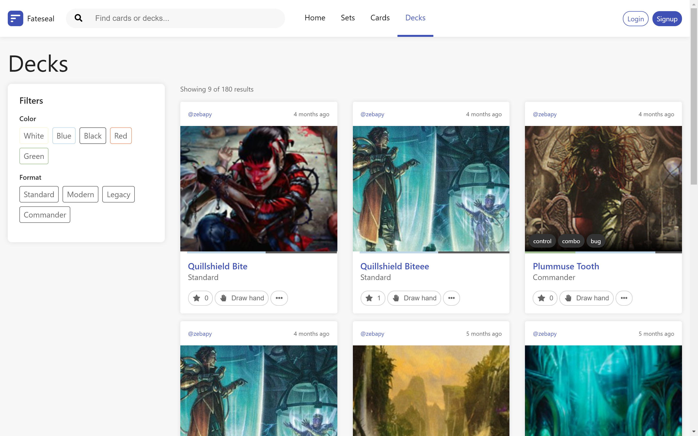

# TODO: put me in a blog post and link to it?

Fateseal is a [Magic: The Gathering](http://en.wikipedia.org/wiki/Magic:_The_Gathering) deck building website with social networking aspects. Fateseal's ultimate goal is to connect MTG players of all skill levels, introduce the game to new players, and improve existing players' skills through deck building, research and analysis of games, and peer review.

## Inception

In 2015, I was just starting to get my toes dipped in some more dynamically built websites. With this new found knowledge, and a hobby of playing Magic: The Gathering at my local game store, I was highly interested in building my own MTG deck building website.

The project was founded by myself and a fellow MTG player/developer, and is maintained in our spare time and funded on the money out of our pockets. We are both very passionate about it and hope to someday turn it into a resource all MTG players look to.

## Tech

Near the end of 2017, Facebook's ReactJS component writing library started to gain immense traction and popularity. After a bit of a learning curve, I became thoroughly invested in the library and rewrote the entire web app in it (I was sick of handlebars and jQuery soup). After going through such a large task like this, the benefits became clear to me over and over; separation of conerns by feature, declarative UI elements that have interactions tied to markup, CSS-in-JS solutions, etc. I'm on that React train for sure.

Before Facebook's next big thing--Graphql--the backend was a Hapi REST api. With this limitation, I found Redux after comparing numerous "flux" solutions and struggling with 'what's the right pick' dilemma I'm sure everyone encountered during this time. Redux became a winner for me.

After Graphql matured a bit more and gained popularity in the community, packages like Apollo came to rise to compete with Relay (which always offput me due to having a strict graphql schema and some complex structures to the client side code).

Today, the site runs off a Graphql API backend with JWT authentication, Apollo for data fetching (Relay always seemed way too complex and I did not like the )

## Style all the things

Through Fateseal's iterations, I've tried many CSS structures and tools.

## Current day

Unfortunately&mdash;or fortunately&mdash;now that I have a day job, I'm finding it diffcult to dedicate as many hours (at least 6k commits and 3 rewrites) as I previously had to coding this project. It still sits on a domain with a low tier MongoDB instance and free hosting on [zeit/now](#) (#notsponsored #sponsormepls) deployment platform.

I have numerous ideas I'd like to add to this project or build off of it, like cron job card data imports, a real-time playtester desktop app, or a mobile app in React Native. But those will have to wait to see the light another day.
