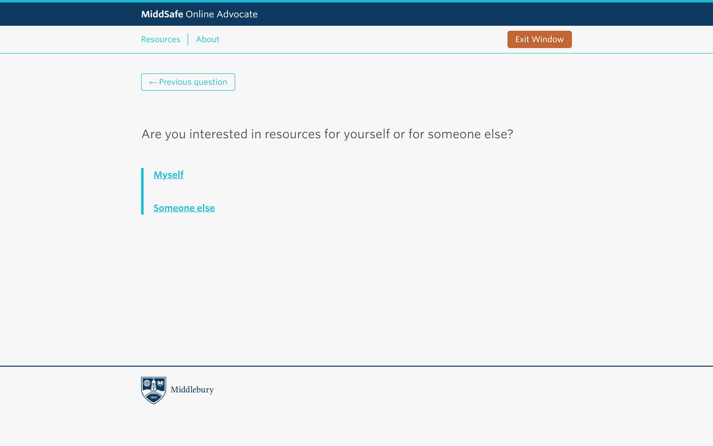
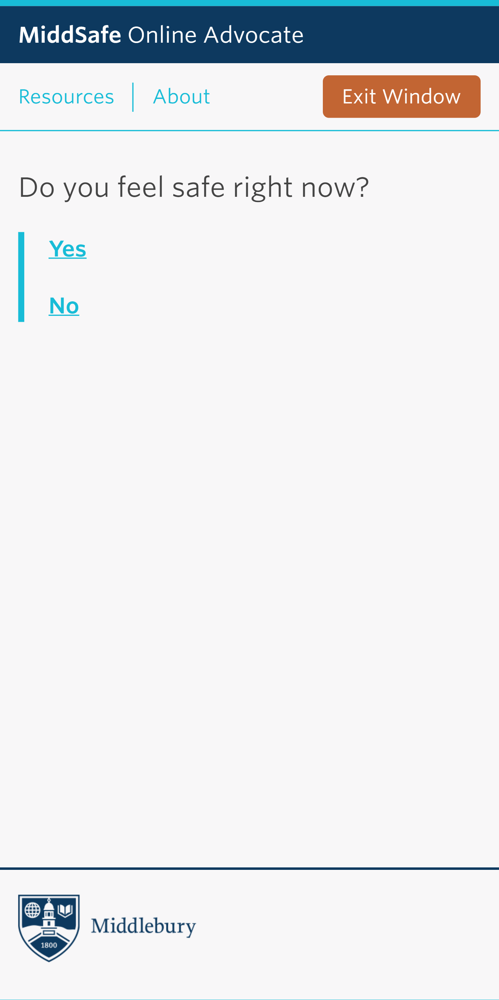

## Goals

The MiddSafe Online Advocate is a tool for peers in need of support and information around sexual assault, stalking, dating violence, domestic violence, and other personal violations. When you’re ready to get started, you will be asked a series of questions in order to find resources that might feel right to you.

### Results

The MiddSafe Online Advocate is a tool for peers in need of support and information around sexual assault, stalking, dating violence, domestic violence, and other personal violations. When you’re ready to get started, you will be asked a series of questions in order to find resources that might feel right to you.

<!--  -->
